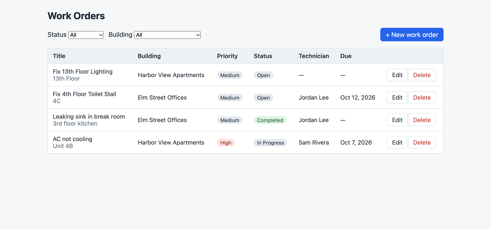
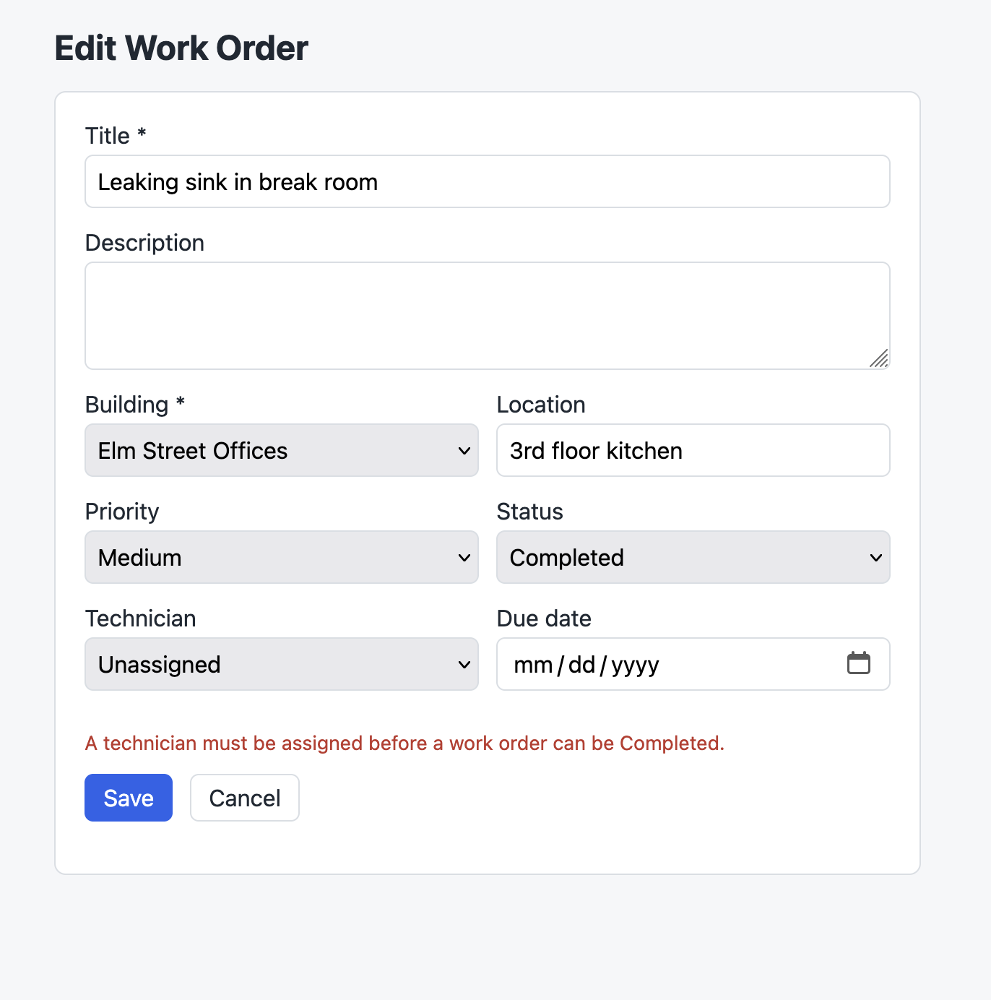

# Building Work Order Tracker

[?branchName=main)](https://dev.azure.com/charlesh90/WorkOrderTracker/_build)

A maintenance work-order tracker for property managers: log repair requests per building, assign them to technicians, and track them through to completion.

**Stack:** ASP.NET Core 8 Web API · EF Core 8 · SQL Server 2022 (Docker) · Angular 19 · xUnit · Azure Pipelines





*Business rules are enforced by the API and surfaced in the form. Here, a work order can't be marked Completed without a technician.*

## Architecture

```
WorkOrderTracker/
├── api/WorkOrderTracker.Api/
│   ├── Controllers/          Thin HTTP layer: Buildings, Technicians, WorkOrders
│   ├── Services/             WorkOrderService: work-order business rules
│   ├── Data/AppDbContext.cs  Fluent configuration, relationships, seed data
│   ├── Dtos/                 Request/response contracts with validation attributes
│   ├── Models/               EF entities
│   └── Migrations/
├── tests/WorkOrderTracker.Api.Tests/
│   ├── *ServiceTests.cs      Business rules against SQLite, with a fixed clock
│   ├── *ControllerTests.cs   Status-code mapping, delete rules, write races
│   └── ApiTests.cs           Full HTTP pipeline via WebApplicationFactory
├── client/                   Angular app (list with filters, add/edit form)
├── docker-compose.yml        SQL Server 2022
└── azure-pipelines.yml       CI: build and test the API and the client
```

## Data model

| Table       | Key columns                                                                     |
|-------------|---------------------------------------------------------------------------------|
| Buildings   | Id, Name, Address                                                               |
| Technicians | Id, Name, Email (unique index), Trade                                           |
| WorkOrders  | Id, Title, Description, Location, Priority, Status, CreatedAt, DueDate, CompletedAt, BuildingId (FK, restrict), TechnicianId (FK, nullable, set null) |

Status and priority are stored as strings so the table can be read without a lookup.

## Business rules

- A work order's building and technician must exist.
- **In Progress** and **Completed** work orders must have a technician.
- Moving to Completed records `CompletedAt`. Reopening a work order clears it.
- A new work order's due date can't be in the past. "Today" is calculated in the business time zone (`Business:TimeZoneId`, default `America/New_York`), not UTC. Otherwise, after 8 PM Eastern, today's date would be rejected.
- A building can't be deleted while it has work orders (**409**).
- A technician can't be deleted while they have in-progress or completed work orders (**409**). Their open, on-hold and cancelled orders become unassigned.

## Design decisions

- **Validation happens in two layers.** Data annotations on the request objects handle field shape, such as required fields, lengths and email format, and `[ApiController]` turns failures into 400s automatically. `WorkOrderService` handles rules that need the database or the clock. Both return the standard ASP.NET `ValidationProblemDetails` error format, so the Angular form shows either kind of error the same way.
- **The database is the last line of defence.** Checking before writing leaves a gap between the check and the save. The unique email index and the restrict foreign key on buildings catch requests that slip through that gap, and the controllers turn the resulting `DbUpdateException` into a 400 or 409 rather than a 500. Tests simulate each race by inserting a row just before `SaveChanges`.
- **Errors use the problem-details format (RFC 7807).** `AddProblemDetails()` plus `UseExceptionHandler()` means unexpected exceptions return a problem-details body without leaking stack traces.
- **Time is injectable.** `WorkOrderService` takes a `TimeProvider`, so tests can freeze the clock, for example at 9:30 PM in New York.

## Testing

```bash
dotnet test
```

58 tests, with about 92% line coverage excluding migrations. They use **SQLite in-memory** instead of EF's InMemory provider, because SQLite enforces foreign keys and unique indexes. That means the tests check the real constraints, not just the application code. `ApiTests` sends real HTTP requests through the full pipeline, so model binding, data-annotation validation and JSON enum handling are covered too.

## CI

[`azure-pipelines.yml`](azure-pipelines.yml) runs two jobs on `ubuntu-24.04` for every push or pull request to `main`:

- **API:** restore, build, test, then publish test results and Cobertura code coverage.
- **Client:** `npm ci`, then a production Angular build.

The tests don't need SQL Server, so the pipeline has no database dependency.

## Run it locally

Prerequisites: .NET 8 SDK, Node 20+, Docker Desktop.

```bash
docker compose up -d                 # SQL Server on localhost:1433

cd api/WorkOrderTracker.Api
dotnet run                           # applies migrations and seed data; Swagger at http://localhost:5080/swagger

cd ../../client
npm install
npm start                            # http://localhost:4200, with /api proxied to the API
```

The EF tool is pinned in `.config/dotnet-tools.json`. After changing the model, run `dotnet tool restore`, then `dotnet ef migrations add <Name>`.

## API

| Method | Route                   | Notes                                                    |
|--------|-------------------------|----------------------------------------------------------|
| GET    | /api/workorders         | Optional `?status=Open&buildingId=1` filters             |
| GET    | /api/workorders/{id}    | 404 if missing                                           |
| POST   | /api/workorders         | 201 with Location header, 400 with validation errors     |
| PUT    | /api/workorders/{id}    | 204, 400 or 404                                          |
| DELETE | /api/workorders/{id}    | 204 or 404                                               |
| *      | /api/buildings[/{id}]   | Same CRUD shape. DELETE returns 409 if the building has work orders |
| *      | /api/technicians[/{id}] | Same CRUD shape. Email must be unique. DELETE returns 409 if the technician has active work |

Full request and response schemas are in Swagger.

## Next steps

- **Optimistic concurrency on PUT:** add a row-version column and return 409 when the row changed since it was read, so two people editing the same work order can't silently overwrite each other.
- **Paging** for `GET /api/workorders`.
- **Secrets:** move the local SQL Server password out of `appsettings.json` into user-secrets or environment variables.
- Angular screens for managing buildings and technicians. The API already supports them.
